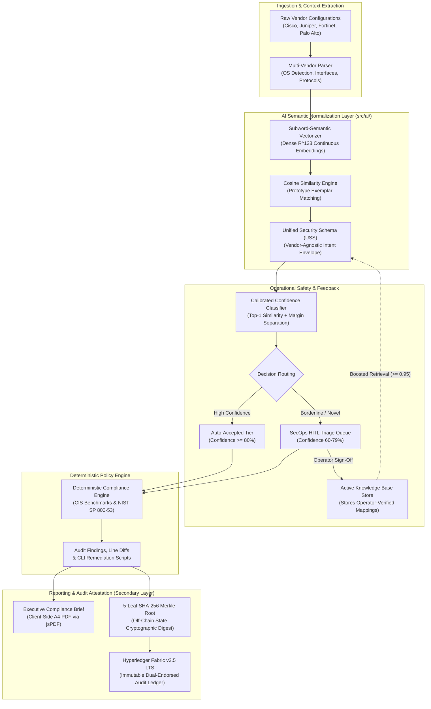
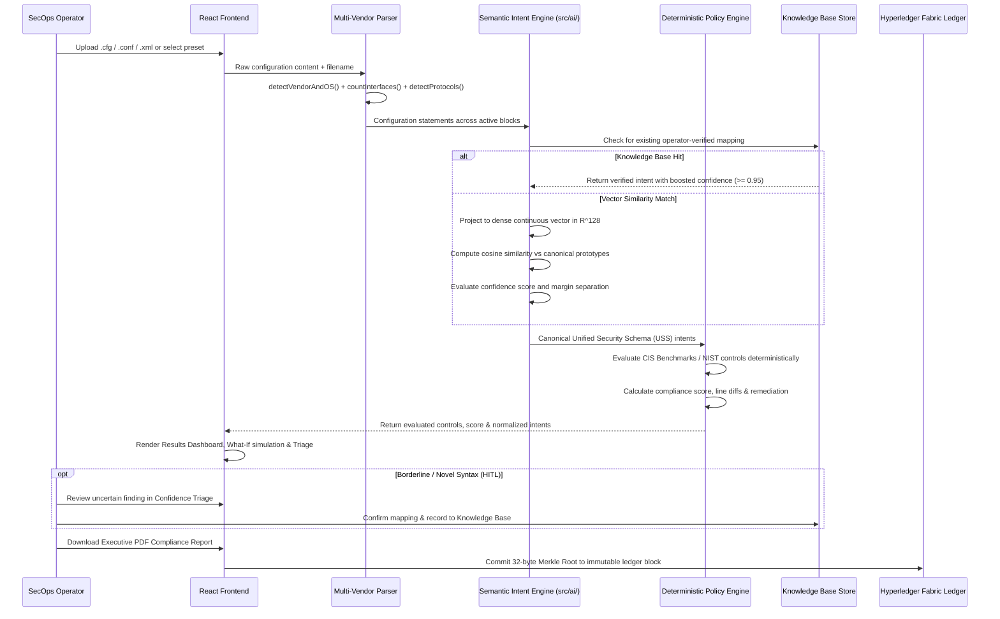
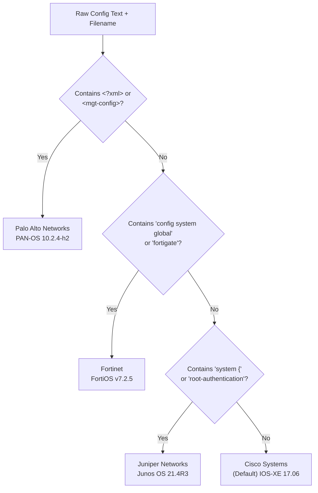
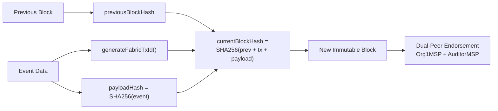
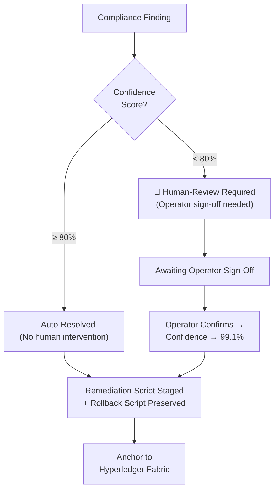
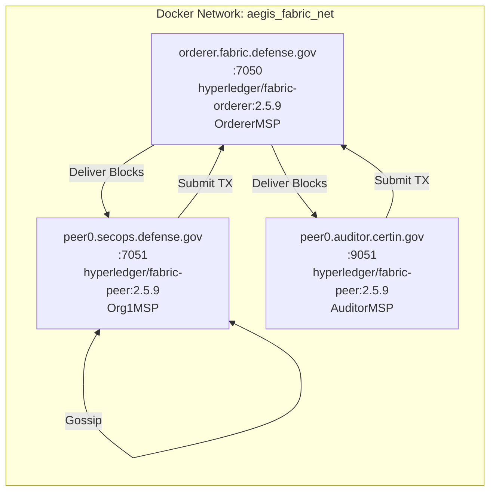
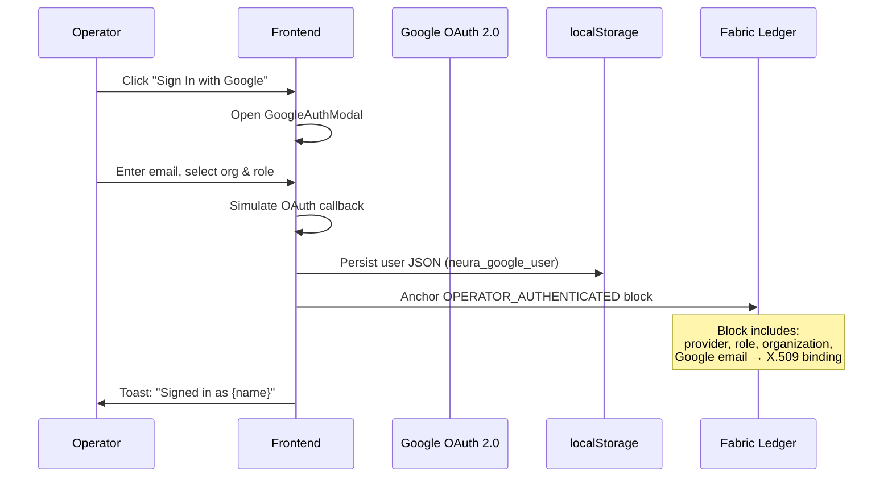
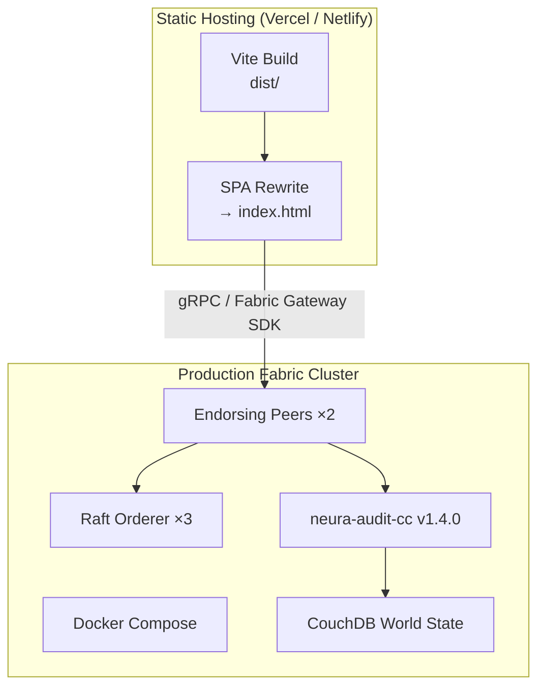

# NeuraComply — Architecture Document

> **AI-Driven Multi-Vendor Network Security Compliance Auditor**
> Built for Smart India Hackathon (SIH) 2026

---

## Table of Contents
1. [High-Level Architecture](#high-level-architecture)
2. [Low-Level Architecture](#low-level-architecture)

---

# High-Level Architecture

## 1. System Overview

NeuraComply is an **AI-driven multi-vendor network security compliance auditor** that ingests device configurations from Cisco, Juniper, Fortinet, and Palo Alto, normalizes them into canonical security intents via a continuous vector embedding engine, structures them according to a **Unified Security Schema (USS)**, deterministically evaluates compliance against CIS Benchmarks / NIST SP 800-53 controls, and anchors every audit event to an **immutable secondary audit ledger (Hyperledger Fabric v2.5 / PostgreSQL)**.



## 2. Architectural Tiers

| Tier | Technology | Responsibility |
|------|-----------|----------------|
| **Presentation** | React 18 + Vite + Lucide Icons | SPA UI with 5 views (Landing, Upload, Results, Triage, Ledger) |
| **Ingestion & Feature Parser** | Vanilla JavaScript (`src/data/auditParser.js`) | Vendor auto-detection (Cisco, Juniper, Forti, PAN), line counting, interface extraction, protocol footprint |
| **Semantic Intent Normalization** | Node.js / ES Modules (`src/ai/`) | Subword character $n$-gram hashing, continuous vector projection ($\mathbb{R}^{128}$), cosine prototype similarity, Unified Security Schema (USS) |
| **Confidence & HITL Safety** | Calibrated classifier (`src/ai/confidence.js`, `knowledgeBase.js`) | Thresholding ($\ge 80\%$ Auto, $60-79\%$ HITL, $<60\%$ Reject), margin calculation, persistent verified mapping reuse |
| **Compliance Evaluation Engine** | Deterministic AST Evaluator | Ultimate compliance authority: CIS Benchmarks, NIST SP 800-53, line-level diffs, remediation & rollback |
| **Relational Backend & State** | Node.js + Express 5 + PostgreSQL 15 | Relational persistence (`devices`, `audit_scans`, `audit_controls`, `triage_items`, `ledger_blocks`) |
| **Secondary Audit Attestation** | Hyperledger Fabric v2.5 LTS + Merkle Tree | Cryptographic 32-byte Merkle root anchor, dual-peer endorsement (`Org1MSP`, `AuditorMSP`), Raft ordering |
| **Executive Reporting** | `jsPDF` + `jspdf-autotable` | Instant client-side generation of downloadable A4 regulatory audit certificate |

## 3. Data Flow — End-to-End Audit Lifecycle



## 4. Multi-Vendor Support Matrix

| Vendor | Config Format | Detection Heuristics | Sample File |
|--------|--------------|---------------------|-------------|
| **Cisco Systems** | `.cfg` (IOS-XE CLI) | `version`, `hostname`, `interface` keywords | `cisco_catalyst9300_enterprise.cfg` |
| **Juniper Networks** | `.conf` (JunOS hierarchy) | `system {`, `root-authentication`, `security-zone` | `juniper_srx340_perimeter.conf` |
| **Palo Alto Networks** | `.xml` (PAN-OS) | `<?xml>`, `<mgt-config>`, `<config>` tags | `paloalto_pa3220_firewall.xml` |
| **Fortinet** | `.conf` (FortiOS flat) | `config system global`, `config firewall` | `fortigate_100f_edge.conf` |

## 5. Compliance Frameworks Covered

| Framework | ID Prefix | Focus |
|-----------|-----------|-------|
| CIS Benchmarks v4.0.0 | `CIS-x.x.x` | L1/L2 network device hardening controls |
| NIST SP 800-53 Rev 5 | `NIST SC/AC/IA/AU` | Federal security & privacy controls |
| DISA STIG Cat I/II | `STIG NET-xxx` | DoD cybersecurity directives |
| CERT-In 2026 | — | Indian cyber security framework |

---

# Low-Level Architecture

## 1. Project File Structure

```
aegis-compliance-auditor/
├── index.html                          # Vite HTML entry point
├── package.json                        # React 18, Vite 5, lucide-react
├── vite.config.js                      # Vite dev server config
├── vercel.json / netlify.toml          # Deployment configs (SPA rewrites)
│
├── src/
│   ├── main.jsx                        # ReactDOM.createRoot entry
│   ├── App.jsx                         # Root component, state hub, view router
│   ├── index.css                       # Full design system (~36KB)
│   │
│   ├── components/
│   │   ├── Navbar.jsx                  # Navigation + auth controls
│   │   ├── Hero.jsx                    # Landing hero section
│   │   ├── Features.jsx               # Feature cards grid
│   │   ├── PullQuote.jsx              # Testimonial/quote section
│   │   ├── UploadScanSection.jsx      # Config upload, preset picker, scanner
│   │   ├── ResultsDashboard.jsx       # Compliance posture, gauge, controls
│   │   ├── ConfidenceTriageView.jsx   # Auto/human-review triage system
│   │   ├── AuditLedgerView.jsx        # Blockchain explorer + verification
│   │   ├── NetworkTopologyGraphic.jsx # Animated network visualization
│   │   ├── ConvergenceVisual.jsx      # Convergence animation
│   │   ├── ReportModal.jsx            # Executive PDF report generator
│   │   └── GoogleAuthModal.jsx        # Google OAuth sign-in flow
│   │
│   └── data/
│       ├── mockData.js                 # Vendor presets, controls, triage items
│       ├── auditParser.js             # Real-time config parser + evaluator
│       ├── auditLedgerService.js      # Generic audit ledger hash chain
│       └── hyperledgerFabricService.js # Fabric-specific block/tx generation
│
├── fabric/
│   ├── chaincode/
│   │   └── compliance_contract.go      # Hyperledger Fabric smart contract
│   ├── docker-compose-fabric.yml       # 3-container Fabric network
│   ├── connection-profile.json         # Fabric Gateway connection config
│   └── README.md                       # Fabric setup instructions
│
├── sample_configs/                     # 5 real vendor config files
│   ├── cisco_catalyst9300_enterprise.cfg
│   ├── cisco_hardened_pci_dss.cfg
│   ├── fortigate_100f_edge.conf
│   ├── juniper_srx340_perimeter.conf
│   └── paloalto_pa3220_firewall.xml
│
└── public/
    ├── sample_configs/                 # Served statically for fetch()
    └── fabric/                         # Public Fabric assets
```

## 2. Module-Level Breakdown

### 2.1 App.jsx — Central State Controller

[App.jsx](file:///c:/Users/KRITHIKA%20.S/.gemini/antigravity-ide/scratch/aegis-compliance-auditor/src/App.jsx) is the **single source of truth** for the entire application. It manages:

| State Variable | Type | Purpose |
|---------------|------|---------|
| `currentView` | `string` | Active view: `'landing'` \| `'upload'` \| `'results'` \| `'triage'` \| `'ledger'` |
| `selectedPreset` | `string` | Active vendor preset ID (e.g. `'cisco-cat9300'`) |
| `customConfig` | `object\|null` | Parsed config from user-uploaded file |
| `customControls` | `array\|null` | Dynamically evaluated compliance controls |
| `user` | `object\|null` | Google OAuth user data (persisted to `localStorage`) |
| `isScanning` | `boolean` | Whether the 4-phase scan animation is running |
| `scanStep` | `number` | Current scan phase (1–4) |
| `whatIfEnabled` | `boolean` | Toggle for "What-If Remediation" score comparison |
| `auditBlocks` | `array` | Immutable array of Hyperledger Fabric blocks |
| `toastMessage` | `string\|null` | Active toast notification |

**View routing** is implemented via conditional rendering (no react-router):
```javascript
{currentView === 'landing'  && <Hero /> + <Features /> + ...}
{currentView === 'upload'   && <UploadScanSection ... />}
{currentView === 'results'  && <ResultsDashboard ... />}
{currentView === 'triage'   && <ConfidenceTriageView ... />}
{currentView === 'ledger'   && <AuditLedgerView ... />}
```

---

### 2.2 auditParser.js — Multi-Vendor Parsing Engine

[auditParser.js](file:///c:/Users/KRITHIKA%20.S/.gemini/antigravity-ide/scratch/aegis-compliance-auditor/src/data/auditParser.js) is the core compliance engine. It contains 4 key functions:

#### `detectVendorAndOS(fileName, content)` → `{ vendor, os, role, vendorType }`
Uses heuristic pattern-matching to identify the device vendor:



#### `detectProtocols(content)` → `string[]`
Scans for keywords: `router ospf`, `router bgp`, `ssh`, `telnet`, `snmp-server`, `ntp server`, `aaa new-model`, `ipsec`, `ip http`.

#### `countInterfaces(content)` → `number`
Counts lines matching `interface `, `edit "port`, `edit "ge-`, `<entry name="ethernet"` (vendor-agnostic).

#### `evaluateRealConfig(fileName, content, checksum)` → `{ parsedConfig, controls[] }`
The **core compliance evaluator**. Maps each of the 8 `AUDIT_CONTROLS` to a deterministic check:

| Control ID | Rule | Detection Logic |
|-----------|------|-----------------|
| `CIS-2.1.4` | Disable Telnet | Searches for `transport input all`, `telnet`, `exec-timeout 0 0` |
| `CIS-1.2.1` | No default SNMP | Searches for `community public`, `community private` |
| `CIS-2.2.2` | Disable HTTP | Searches for `ip http server` without `no ip http server` |
| `CIS-1.1.2` | Password encryption | Searches for `no service password-encryption` |
| `CIS-3.1.5` | Login banner | Checks absence of `banner login`, `banner motd` |
| `CIS-4.2.1` | Management ACL | Checks for `access-class`, `protect-re`, `trusthost1` |
| `CIS-5.1.1` | NTP authentication | Always `passed` (baseline) |
| `CIS-6.3.2` | AAA framework | Always `passed` (baseline) |

**Scoring formula:**
```
rawScore = ((passedCount × 1.0 + warningCount × 0.5) / total) × 100
finalScore = clamp(rawScore, 65, 100)
```

Each violation includes an `offendingSnippet` with exact line numbers extracted from the uploaded config.

---

### 2.3 hyperledgerFabricService.js — Blockchain Integration

[hyperledgerFabricService.js](file:///c:/Users/KRITHIKA%20.S/.gemini/antigravity-ide/scratch/aegis-compliance-auditor/src/data/hyperledgerFabricService.js) manages the **Fabric-compatible block chain** on the client side.

#### Network Configuration
```
Channel:   neura-compliance-channel
Chaincode: neura-audit-cc:v1.4.0
Consensus: Raft (3-node crash fault tolerant)
Endorsement: AND('Org1MSP.peer', 'AuditorMSP.peer')

Organizations:
  ├── Org1MSP      → peer0.secops.defense.gov:7051
  └── AuditorMSP   → peer0.auditor.certin.gov:9051

Orderers:
  ├── orderer0.fabric.defense.gov:7050
  ├── orderer1.fabric.defense.gov:7050
  └── orderer2.fabric.defense.gov:7050
```

#### Block Structure
Each block contains:
```javascript
{
  blockNumber,              // Sequential integer
  txId,                     // 64-char SHA-256 hex (deterministic)
  timestamp,                // ISO 8601 UTC
  channelId,                // 'neura-compliance-channel'
  chaincodeId,              // 'neura-audit-cc:v1.4.0'
  validationCode,           // 'VALID (TxValidationCode 0)'
  eventType,                // GENESIS_ANCHOR | CONFIG_INGESTED | SCAN_COMPLETED | VIOLATION_FLAGGED | REMEDIATION_CONFIRMED | OPERATOR_AUTHENTICATED
  eventTitle,
  eventDescription,
  targetSystem,
  operator,
  mspId,                    // Org1MSP | AuditorMSP | OrdererOrg
  payloadHash,              // 64-char SHA-256 of event payload
  previousBlockHash,        // Chain link to prior block
  currentBlockHash,         // Hash of (prevHash + txId + payload)
  endorsingPeers[],         // [{peer, msp, status: 'ENDORSED_200'}]
  readWriteSet: {           // Fabric Read-Write Set
    readKeys[],
    writtenKeys[]
  },
  metadata: {}              // Event-specific data
}
```

#### `createFabricBlock()` — Block Creation Flow


---

### 2.4 Smart Contract (Go Chaincode)

[compliance_contract.go](file:///c:/Users/KRITHIKA%20.S/.gemini/antigravity-ide/scratch/aegis-compliance-auditor/fabric/chaincode/compliance_contract.go) is the production-ready Hyperledger Fabric chaincode:

#### Data Models
```go
type AuditRecord struct {
    DocType, TxID, Timestamp, DeviceID, Vendor, OperatingSystem string
    BlockNumber                                                 uint64
    ASTChecksum, OperatorIdentity, PreviousRecordHash          string
    RulesEvaluated, PassedCount, ViolationsCount, ComplianceScore int
    EndorsingPeers []string
    Metadata       map[string]string
}

type RemediationRecord struct {
    DocType, TxID, Timestamp, ControlCode string
    ConfidenceScore                       float64
    RemediationCLI, OperatorIdentity, Status string
}
```

#### Contract Functions
| Function | Purpose | State DB Key Pattern |
|----------|---------|---------------------|
| `InitLedger()` | Write genesis block | `RECORD_GENESIS` |
| `RecordAuditScan()` | Commit audit result + emit `AuditScanCommitted` event | Caller-provided key |
| `QueryAuditRecord()` | Read audit record by key | Caller-provided key |

---

### 2.5 Component Architecture

```mermaid
graph TB
    subgraph "App.jsx (Root State Hub)"
        STATE["Lifted State:<br/>currentView, auditBlocks,<br/>user, activeConfig,<br/>activeControls"]
    end

    STATE --> NAV["Navbar.jsx<br/>• View navigation tabs<br/>• Auth controls<br/>• Report trigger"]
    STATE --> HERO["Hero.jsx<br/>• Landing CTA<br/>• Preset quick-load"]
    STATE --> FEAT["Features.jsx<br/>• 3 feature cards<br/>• Triage nav link"]
    STATE --> PULL["PullQuote.jsx<br/>• Testimonial quote"]
    STATE --> UPLOAD["UploadScanSection.jsx<br/>• Vendor preset grid (4 presets)<br/>• File upload (drag & drop)<br/>• Real sample config picker (5 files)<br/>• 4-phase scan animation<br/>• AST tree preview"]
    STATE --> DASH["ResultsDashboard.jsx<br/>• Compliance score gauge<br/>• Controls table (pass/warn/violation)<br/>• What-If remediation toggle<br/>• Offending snippet viewer"]
    STATE --> TRIAGE_C["ConfidenceTriageView.jsx<br/>• Auto-resolved items (≥80% conf.)<br/>• Human-review items (&lt;80% conf.)<br/>• Operator confirm action<br/>• Remediation/rollback scripts"]
    STATE --> LEDGER_C["AuditLedgerView.jsx<br/>• Block explorer table<br/>• Block detail expander<br/>• Hash verification animation<br/>• Fabric topology display<br/>• Chaincode info panel"]
    STATE --> REPORT_M["ReportModal.jsx<br/>• Executive summary PDF<br/>• Framework compliance stats"]
    STATE --> GAUTH["GoogleAuthModal.jsx<br/>• Google SSO simulation<br/>• Organization & role selection"]
    STATE --> TOPO["NetworkTopologyGraphic.jsx<br/>• Animated network diagram"]
    STATE --> CONV["ConvergenceVisual.jsx<br/>• Score convergence animation"]
```



---

### 2.6 Confidence Triage System (Differentiator)

The triage system classifies findings into two categories based on **AI confidence scores**:



| Triage ID | Control | Confidence | Classification | Reason |
|-----------|---------|-----------|----------------|--------|
| TR-101 | CIS-2.1.4 (Telnet) | 99.4% | Auto-resolved | Unambiguous AST match, zero blast radius |
| TR-102 | CIS-1.2.1 (SNMP) | 98.7% | Auto-resolved | Exact CVE/CWE dictionary match |
| TR-103 | CIS-2.2.2 (HTTP) | 97.5% | Auto-resolved | Deterministic AST confirmation |
| TR-201 | CIS-4.2.1 (ACL) | 78.2% | Human-review | Semantic ambiguity in subnet allocation |
| TR-202 | CIS-3.1.2 (OSPF) | 76.8% | Human-review | Route flap risk requires coordination |

---

### 2.7 Fabric Docker Network Topology

[docker-compose-fabric.yml](file:///c:/Users/KRITHIKA%20.S/.gemini/antigravity-ide/scratch/aegis-compliance-auditor/fabric/docker-compose-fabric.yml) defines a 3-container Fabric network:



---

### 2.8 Authentication & Identity Flow



---

### 2.9 Scan Pipeline — 4-Phase Animation

When the operator triggers a scan, a **phased scan animation** runs:

```mermaid
gantt
    title 4-Phase Compliance Scan Pipeline
    dateFormat X
    axisFormat %Ls

    section Phases
    Phase 1 - AST Lexer Tokenization    :0, 500
    Phase 2 - Canonical Normalization    :500, 1100
    Phase 3 - Rule Evaluation Engine     :1100, 1800
    Phase 4 - Blockchain Anchor & Score  :1800, 2500
```



| Phase | Duration | Action |
|-------|----------|--------|
| 1 | 0–500ms | AST Lexer tokenizes vendor-specific config |
| 2 | 500–1100ms | Canonical normalization to vendor-agnostic representation |
| 3 | 1100–1800ms | CIS/NIST rule evaluation engine runs all controls |
| 4 | 1800–2500ms | Anchor `SCAN_COMPLETED` block to Fabric ledger, compute score |

A **fast-forward** option skips the animation and loads results instantly.

---

### 2.10 Key Design Decisions

| Decision | Rationale |
|----------|-----------|
| **Client-side parsing** | No backend server needed for SIH demo; all parsing runs in the browser via `auditParser.js` |
| **Simulated Fabric on frontend** | `hyperledgerFabricService.js` generates Fabric-compatible blocks client-side; `fabric/` directory contains production-ready Go chaincode + Docker Compose for real deployment |
| **Dual ledger services** | `auditLedgerService.js` (generic hash chain) exists alongside `hyperledgerFabricService.js` (Fabric-specific) — the app uses the Fabric service |
| **Lifted state in App.jsx** | Single component manages all global state; no external state library (Redux/Zustand) needed for this scope |
| **Vendor detection via heuristics** | Simple keyword/pattern matching avoids needing ANTLR4 grammar parsers in the browser |
| **Confidence-based triage** | Unique differentiator: findings at or above 80% confidence (and 10% margin) auto-resolve; below 80% require human sign-off to prevent dangerous auto-remediation |
| **Web Crypto API for checksums** | Uses `crypto.subtle.digest('SHA-256')` for real checksums with a fallback hash for environments without Web Crypto |

---

### 2.11 Deployment Architecture



> **Current prototype**: Entirely client-side (blockchain simulation in browser state).
> **Production path**: Connect frontend to Fabric Gateway SDK → real endorsing peers via gRPC.
