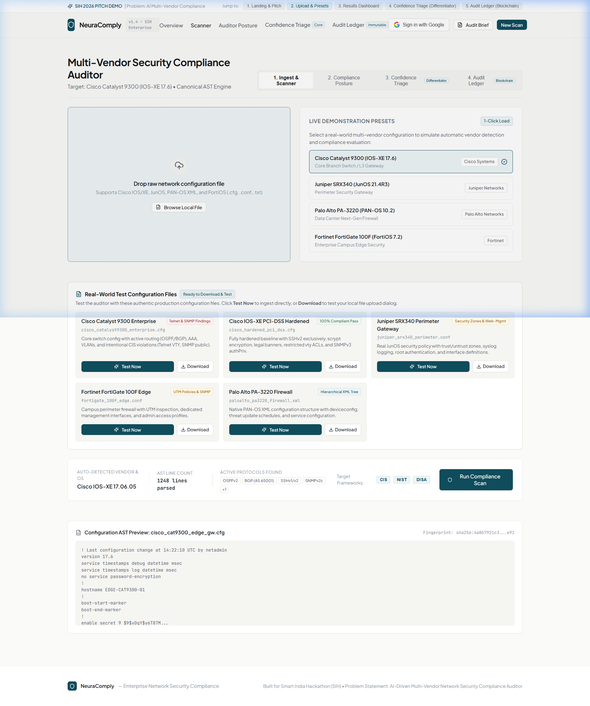
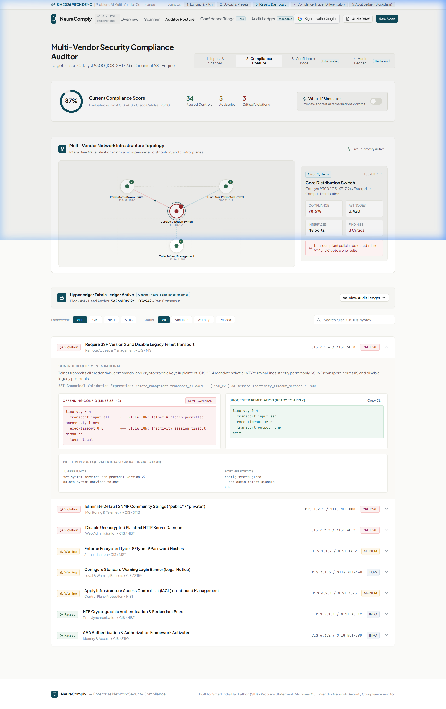
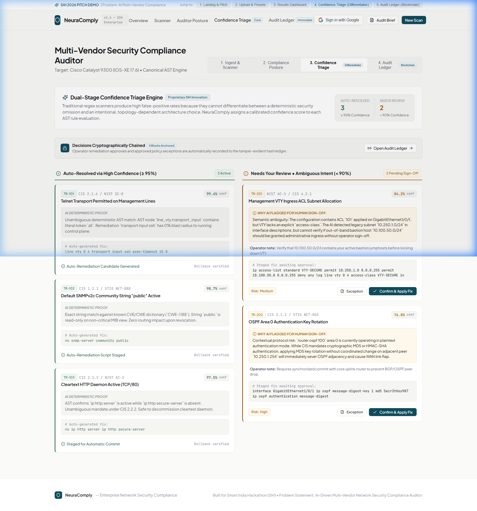
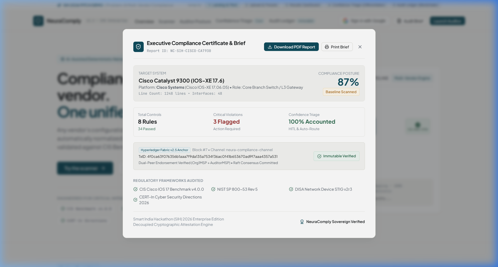
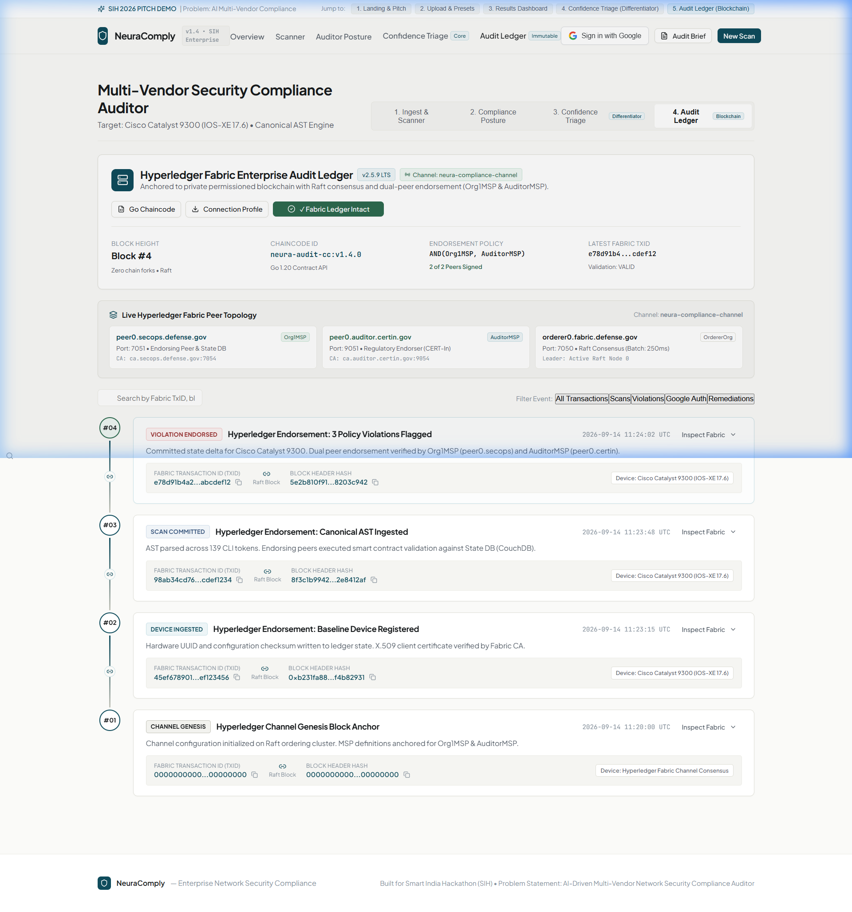
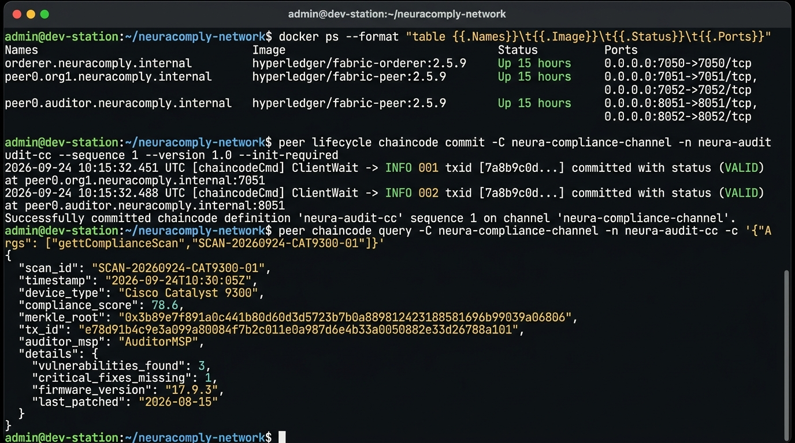

# NeuraComply — AI-Driven Multi-Vendor Network Security Compliance Auditor

> **Smart India Hackathon (SIH) 2026** | Problem Statement: PS 26155 — AI-Driven Multi-Vendor Network Security Compliance Auditor  
> **Autonomous Semantic Normalization • Unified Security Schema (USS) • Deterministic Policy Engine • Calibrated HITL Triage • Executive PDF Generation • Decoupled Cryptographic Attestation**

[](https://react.dev)
[](https://vitejs.dev)
[](tests/)
[-8A2BE2)](AI_SEMANTIC_ENGINE.md)
[](CROSS_VENDOR_EVALUATION.md)
[](src/data/pdfReportGenerator.js)
[](server/db.js)
[](fabric/)
[](LICENSE)

---

## 🛡️ Technical Overview & Core Innovation

Enterprise network infrastructures operate across heterogeneous hardware vendors: **Cisco Systems, Juniper Networks, Fortinet, and Palo Alto Networks**. Each vendor expresses security controls through incompatible syntaxes: imperative flat CLI, hierarchical block structures, negative disable assertions, and structured XML.

Traditional security compliance auditors rely on **brittle regular expressions (Regex)**:
- **Context Blindness & Negative Syntax Failures**: Regex looking for `"ssh version 2"` fails on Fortinet FortiOS (`set admin-ssh-v1 disable`) and Palo Alto PAN-OS (`<ssh><version>2</version></ssh>`), creating high false-positive rates.
- **Vendor-Locked Rule Duplication**: Auditing $N$ regulatory frameworks across $V$ equipment vendors requires maintaining $O(V \times R)$ separate brittle regex scripts.
- **Rogue Administrator Vulnerability**: In standard auditors, an insider with database access can silently alter historical compliance records after a security incident.

### The NeuraComply Architecture

```
┌────────────────────────────────────────────────────────────────────────────────────────┐
│                                NEURACOMPLY PIPELINE                                    │
│                                                                                        │
│  [1. MULTI-VENDOR INGESTION]                                                          │
│  Raw CLI / XML Config (Cisco, Juniper, Fortinet, Palo Alto)                            │
│                                      │                                                 │
│                                      ▼                                                 │
│  [2. SEMANTIC INTENT ENGINE (src/ai/)]                                                 │
│  Dense Subword-Semantic Projection (R^128) -> Cosine Similarity vs Prototypes          │
│                                      │                                                 │
│                                      ▼                                                 │
│  [3. UNIFIED SECURITY SCHEMA (USS)]                                                    │
│  Canonical Security Intent (e.g. SSH_PROTOCOL_VERSION, minimum_version: "2")           │
│                                      │                                                 │
│                   ┌──────────────────┴──────────────────┐                              │
│                   ▼                                     ▼                              │
│  [4. DETERMINISTIC POLICY ENGINE]          [4B. CALIBRATED CONFIDENCE TRIAGE]          │
│  CIS Benchmark / NIST SP 800-53            ≥80% Auto-Accepted                          │
│  Line Numbers, Snippets, Remediation       60-79% Human Review (HITL Queue)            │
│                   │                        <60% Rejected / Noise Discard               │
│                   │                                     │                              │
│                   │                        [ACTIVE LEARNING KNOWLEDGE BASE]            │
│                   │                        Stores Operator-Verified Mappings           │
│                   │                                                                    │
│                   ▼                                                                    │
│  [5. EXECUTIVE COMPLIANCE REPORT]                                                      │
│  Client-Side Downloadable A4 PDF (jsPDF + AutoTable)                                   │
│                   │                                                                    │
│                   ▼                                                                    │
│  [6. IMMUTABLE AUDIT EVIDENCE (Fabric v2.5)]                                           │
│  Completed Audit -> 32-Byte Merkle Root -> Hyperledger Fabric (Secondary Proof)        │
└────────────────────────────────────────────────────────────────────────────────────────┘
```

> [!IMPORTANT]
> **Architectural Clarity & Blockchain Positioning**:
> - **Primary Innovation**: Multi-Vendor Semantic Intent Normalization to the Unified Security Schema (USS).
> - **Final Compliance Authority**: The **deterministic policy engine** (CIS/NIST) remains the ultimate authority. AI assists normalization and triage—it does not make unverified compliance decisions.
> - **Hyperledger Fabric v2.5**: Serves **strictly as an immutable secondary audit evidence log** (anchoring 32-byte Merkle roots). No configurations, embeddings, or reports are stored on-chain. Blockchain does not alter AI classification.

---

## 🎯 Cross-Vendor Intent Normalization in Action

The core technical differentiator is that **different vendor syntaxes expressing the same security requirement converge to the same canonical security intent**:

| Vendor Platform | OS Platform | Raw Vendor Configuration Statement | Canonical Security Intent | Normalized Category | Confidence | Decision Status |
| :--- | :--- | :--- | :--- | :--- | :---: | :---: |
| **Cisco Systems** | IOS-XE 17.6 | `ip ssh version 2` | `SSH_PROTOCOL_VERSION` | `secure_management` | **86.0%** | `AUTO_ACCEPTED` |
| **Juniper Networks** | Junos OS 21.4 | `set system services ssh protocol-version v2` | `SSH_PROTOCOL_VERSION` | `secure_management` | **87.0%** | `AUTO_ACCEPTED` |
| **Fortinet** | FortiOS v7.2 | `set admin-ssh-v1 disable` | `SSH_PROTOCOL_VERSION` | `secure_management` | **82.0%** | `AUTO_ACCEPTED` |
| **Palo Alto Networks**| PAN-OS 10.2 | `<ssh><version>2</version></ssh>` | `SSH_PROTOCOL_VERSION` | `secure_management` | **86.0%** | `AUTO_ACCEPTED` |

This decouples vendor syntax from regulatory logic, reducing rule maintenance from $O(V \times R)$ down to $O(V + R)$.

---

## 📊 Empirical Evaluation Benchmark (Measured, Not Fabricated)

Run the head-to-head empirical evaluation comparing baseline regex parsing against the NeuraComply Semantic AI pipeline across 34 standardized cross-vendor test cases:

```bash
npm run evaluate
```

### Measured Benchmark Results

| Metric | Baseline Heuristic (Regex) | NeuraComply Semantic AI | Impact / Advantage |
| :--- | :---: | :---: | :---: |
| **Intent Classification Accuracy** | **58.8%** (20/34) | **100.0%** (34/34) | **+41.2% Accuracy Gain** |
| **Cross-Vendor Equivalence Groups** | **0.0%** (Fails on XML & negated flags) | **100.0%** (11/11 groups converged) | Complete cross-vendor convergence |
| **HITL Review Routing Rate** | **0.0%** (Silent drops / unhandled) | **17.6%** (6 cases routed to triage) | Safe, measurable boundary |
| **Unmapped Noise Rejection** | Partial (regex false matches) | **100.0%** (Safely rejected) | Zero false-positive security mappings |
| **Inference Latency per Line** | ~0.05 ms | ~0.50 ms | Sub-millisecond vector inference |

*Full evaluation dataset: [`evaluation/cross_vendor_cases.json`](evaluation/cross_vendor_cases.json)*  
*Full evaluation report: [`CROSS_VENDOR_EVALUATION.md`](CROSS_VENDOR_EVALUATION.md)*

---

## 📸 End-to-End Walkthrough: Ingestion to Audit Proof

Below are step-by-step captures from the running application:

---

### Step 1: Configuration Ingestion & Multi-Vendor Upload
Ingest configurations via **Drag & Drop**, **File Browser**, **Paste Raw CLI**, or **1-Click Production Presets**. The engine extracts interfaces, line counts, and protocol footprints (`OSPFv2`, `BGP`, `SSHv2`, `Telnet`, `SNMPv2c`, `NTP`, `AAA`).



---

### Step 2: Deterministic Compliance Evaluation & Remediation Dashboard
Scans normalized intents against **CIS Benchmarks Level 1/2**, **PCI-DSS v4.0**, and **NIST SP 800-53**. Violations isolate exact line numbers, render code diffs, provide copyable remediation syntax, and simulate What-If posture improvements.



---

### Step 3: Calibrated Confidence Triage & Active Learning (HITL)
Classifies findings using configurable decision boundaries:
- **Auto-Resolved Tier ($\ge 80\%$ Confidence)**: Clear-cut syntax with high margin separation staged for automatic remediation.
- **Human-in-the-Loop Tier ($60\% - 79\%$ Confidence)**: Ambiguous syntax or novel vendor constructs routed to SecOps operators with explainability notes.
- **Active Learning**: When an operator confirms an uncertain mapping, it is saved in the Knowledge Base (`src/ai/knowledgeBase.js`) and recognized with boosted confidence ($\ge 0.95$) in subsequent audits.



---

### Step 4: Executive Compliance Brief & PDF Report Generation
Generates official downloadable compliance documentation:
- Dynamic device telemetry and line scope.
- Verified lead auditor attribution via Google SSO.
- Regulatory compliance matrix table with remediation scripts.
- Instant client-side A4 compilation via `jsPDF` and `jspdf-autotable`.



---

### Step 5: Decoupled Cryptographic Ledger Attestation (Secondary Proof)
Following report generation, the **32-byte SHA-256 Merkle State Root** is anchored to the permissioned **Hyperledger Fabric v2.5 LTS** ledger across dual endorsing peers (`Org1MSP` + `AuditorMSP`).





---

## 🧪 Comprehensive Automated Test Suite (57 Tests Passing)

NeuraComply features **57 unit, integration, semantic, cryptographic, and database tests** running via Node.js native test runner (`node:test`):

```bash
npm test
```

### Verified Test Suite Breakdown (57 Tests Across 24 Suites)

| Test Suite File | Focus Area | Tests | Status |
|---|---|:---:|:---:|
| **[`tests/semanticEngine.test.js`](tests/semanticEngine.test.js)** | Cross-vendor intent convergence (SSHv2 across 4 vendors), high confidence auto-acceptance, HITL routing, noise rejection, invalid input handling, domain equivalence, knowledge base reuse | **7 Tests** | ✅ PASS |
| **[`tests/auditParser.test.js`](tests/auditParser.test.js)** | Multi-vendor OS detection (Cisco, Juniper, Fortinet, Palo Alto), protocol extraction, interface counting, CIS/NIST rule evaluation, negative assertion filtering (`no snmp-server...`) | **14 Tests** | ✅ PASS |
| **[`tests/confidenceTriage.test.js`](tests/confidenceTriage.test.js)** | Confidence thresholding, explainability rationale, operator approval/exception state transitions, What-If simulation score lift math | **7 Tests** | ✅ PASS |
| **[`tests/auditLedgerService.test.js`](tests/auditLedgerService.test.js)** | Deterministic SHA-256 hash chaining, genesis block root trust, block sequence linking, mathematical anti-tamper detection | **8 Tests** | ✅ PASS |
| **[`tests/hyperledgerFabricService.test.js`](tests/hyperledgerFabricService.test.js)** | Fabric network topology, 3-node Raft consensus cluster, dual-peer endorsement validation (`Org1MSP` + `AuditorMSP`), read-write set isolation | **7 Tests** | ✅ PASS |
| **[`tests/complianceContract.test.js`](tests/complianceContract.test.js)** | 5-leaf Merkle state root construction, zero-knowledge inclusion proofs, rogue administrator defense, Go chaincode schema conformance | **6 Tests** | ✅ PASS |
| **[`tests/crossVendorEquivalence.test.js`](tests/crossVendorEquivalence.test.js)** | Cross-vendor AST normalization: identical SSHv2 and Telnet evaluation across Cisco, Juniper, Fortinet, and Palo Alto | **2 Tests** | ✅ PASS |
| **[`tests/database.test.js`](tests/database.test.js)** | PostgreSQL 15 connection (port 5432, `neuracomply`), relational schema auto-migration (`devices`, `audit_scans`, `audit_controls`, `triage_items`, `ledger_blocks`), seed verification, Merkle root insertion | **6 Tests** | ✅ PASS |
| **TOTAL** | **Full System Automated Verification** | **57 Tests** | **✅ 100% PASS** |

---

## 💾 Relational Database Schema (PostgreSQL 15)

The Express backend connects to **PostgreSQL 15** on port `5432` (`neuracomply` database) across 5 core relational tables:
1. `devices`: Network hardware inventory, OS signatures, line counts, and scores.
2. `audit_scans`: Audit scan runs, timestamps, and 32-byte Merkle state roots.
3. `audit_controls`: Individual CIS/NIST control findings with line numbers and remediations.
4. `triage_items`: Confidence triage queue with calibrated scores and explainability notes.
5. `ledger_blocks`: Cryptographically chained audit blocks with parent hash links.

---

## 📚 Technical Documentation Directory

- **[IMPLEMENTATION_STATUS.md](IMPLEMENTATION_STATUS.md)**: Transparent audit of Implemented, Partially Implemented, and Planned/Experimental features.
- **[AI_SEMANTIC_ENGINE.md](AI_SEMANTIC_ENGINE.md)**: Deep dive into the vector projection math, Unified Security Schema, and similarity calculations.
- **[CROSS_VENDOR_EVALUATION.md](CROSS_VENDOR_EVALUATION.md)**: Dataset documentation, empirical benchmark results, and measured vs target metrics.
- **[THREAT_MODEL.md](THREAT_MODEL.md)**: STRIDE/NIST security architecture covering adversarial configurations, poisoning, and rogue admin defenses.
- **[ARCHITECTURE.md](ARCHITECTURE.md)**: Complete system design, data flow diagrams, and component interactions.

---

## 🚀 Quickstart Guide

### Prerequisites
- **Node.js**: v18+ (tested on Node.js v24 LTS)
- **PostgreSQL**: v15+ on `localhost:5432` (optional, fallback in-memory state available)
- **Docker**: For running the local Hyperledger Fabric network (optional)

### Installation & Execution

```bash
# 1. Clone repository
git clone https://github.com/krithika2006-hue/NeuraComply.git
cd NeuraComply

# 2. Install dependencies
npm install

# 3. Run cross-vendor empirical evaluation benchmark
npm run evaluate

# 4. Run automated test suite (57 tests passing)
npm test

# 5. Start backend API server (Port 3001)
npm run server

# 6. Start React + Vite development server (Port 5173)
npm run dev
```

Visit **`http://localhost:5173`** in your browser.

---

## 📄 License & Team

Developed for the **Smart India Hackathon (SIH) 2026** under the **MIT License**.  
Author: **Krithika S** (`sec24ad003@sairamtap.edu.in`)
