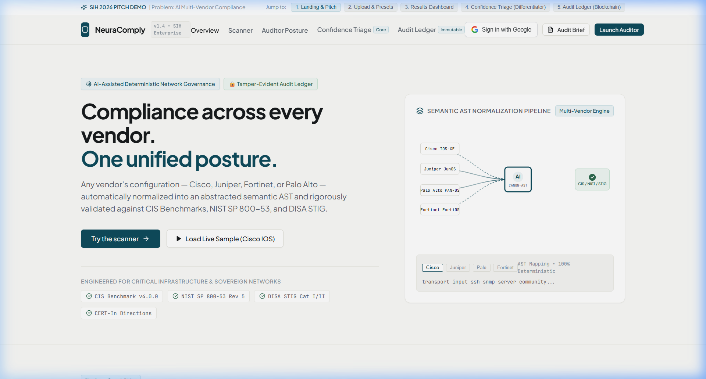

# NeuraComply — AI-Driven Multi-Vendor Network Security Compliance Auditor

> **Smart India Hackathon (SIH) 2026** | Problem Statement: AI-Driven Multi-Vendor Network Security Compliance Auditor

[](https://react.dev)
[](https://vitejs.dev)
[](https://hyperledger.org/projects/fabric)
[](LICENSE)

---

## 🛡️ Overview

**NeuraComply** is an enterprise-grade, browser-based network security compliance auditor that ingests device configurations from **Cisco, Juniper, Fortinet, and Palo Alto**, normalizes them into a **vendor-agnostic canonical AST**, evaluates them against **CIS Benchmarks, NIST SP 800-53, and DISA STIG** frameworks, and anchors every audit event to an **immutable Hyperledger Fabric blockchain ledger**.

### Key Differentiators

- **🤖 Confidence-Scored Triage** — Automatically resolves findings with ≥95% confidence; flags ambiguous results for human sign-off with full explainability
- **🔗 Blockchain Audit Trail** — Every scan, violation, and remediation is cryptographically chained on Hyperledger Fabric with dual-peer endorsement
- **🌐 Multi-Vendor AST Engine** — One unified compliance posture across Cisco IOS-XE, Juniper JunOS, Palo Alto PAN-OS, and Fortinet FortiOS
- **📊 What-If Remediation** — Toggle simulated remediations to preview score improvements before committing changes

---

## 📸 Prototype Screenshots

### 1. Landing Page & Pitch


### 2. Multi-Vendor Scanner & Config Upload


### 3. Compliance Posture Dashboard


### 4. Confidence Triage Engine (Core Differentiator)


### 5. Immutable Audit Ledger (Hyperledger Fabric Blockchain)


---

## 🏗️ Architecture

For detailed high-level and low-level architecture documentation, see **[ARCHITECTURE.md](ARCHITECTURE.md)**.

### Tech Stack

| Layer | Technology |
|-------|-----------|
| Frontend | React 18 + Vite 5 + Lucide Icons |
| Styling | Vanilla CSS (Enterprise Design System) |
| Parsing Engine | JavaScript (client-side AST normalization) |
| Blockchain | Hyperledger Fabric v2.5 LTS (Go chaincode) |
| Authentication | Google OAuth 2.0 (SSO) |
| Deployment | Vercel / Netlify (SPA) |

### Project Structure

```
neura-comply/
├── src/
│   ├── App.jsx                         # Root state controller & view router
│   ├── index.css                       # Full design system (~36KB)
│   ├── components/
│   │   ├── Navbar.jsx                  # Navigation + auth
│   │   ├── Hero.jsx                    # Landing hero
│   │   ├── UploadScanSection.jsx       # Config upload & scanner
│   │   ├── ResultsDashboard.jsx        # Compliance posture & controls
│   │   ├── ConfidenceTriageView.jsx    # AI triage (auto vs human-review)
│   │   ├── AuditLedgerView.jsx         # Blockchain explorer
│   │   ├── ReportModal.jsx             # Executive PDF report
│   │   └── GoogleAuthModal.jsx         # Google SSO
│   └── data/
│       ├── auditParser.js              # Multi-vendor config parser
│       ├── hyperledgerFabricService.js  # Fabric block generation
│       ├── auditLedgerService.js        # Hash chain engine
│       └── mockData.js                 # Vendor presets & controls
├── fabric/
│   ├── chaincode/compliance_contract.go # Hyperledger Fabric smart contract
│   ├── docker-compose-fabric.yml        # Fabric network (3 containers)
│   └── connection-profile.json          # Fabric Gateway config
├── sample_configs/                      # 5 real vendor config files
│   ├── cisco_catalyst9300_enterprise.cfg
│   ├── cisco_hardened_pci_dss.cfg
│   ├── juniper_srx340_perimeter.conf
│   ├── fortigate_100f_edge.conf
│   └── paloalto_pa3220_firewall.xml
└── screenshots/                         # Prototype screenshots
```

---

## 🚀 Getting Started

### Prerequisites

- **Node.js** 18+ and **npm**
- (Optional) **Docker** for running the Hyperledger Fabric network

### Installation

```bash
# Clone the repository
git clone https://github.com/YOUR_USERNAME/neura-comply.git
cd neura-comply

# Install dependencies
npm install

# Start the development server
npm run dev
```

The app will be available at `http://localhost:5173`.

### Production Build

```bash
npm run build
npm run preview
```

---

## 🔗 Hyperledger Fabric Network (Optional)

To run the real blockchain backend:

```bash
# Start the Fabric peer containers and Raft orderer
docker-compose -f fabric/docker-compose-fabric.yml up -d

# Package and install the Go chaincode
peer lifecycle chaincode package neura-audit-cc.tar.gz \
  --path ./fabric/chaincode --lang golang --label neura-audit-cc_1.4

# Commit chaincode definition to channel
peer lifecycle chaincode commit -o localhost:7050 \
  --channelID neura-compliance-channel \
  --name neura-audit-cc --version 1.4 --sequence 1
```

See [fabric/README.md](fabric/README.md) for full details.

---

## 📋 Supported Vendors & Frameworks

### Vendor Support

| Vendor | Config Format | Detection Method |
|--------|--------------|-----------------|
| Cisco Systems | `.cfg` (IOS-XE CLI) | Keyword heuristics |
| Juniper Networks | `.conf` (JunOS hierarchy) | Structural pattern matching |
| Palo Alto Networks | `.xml` (PAN-OS) | XML tag detection |
| Fortinet | `.conf` (FortiOS flat) | Keyword heuristics |

### Compliance Frameworks

| Framework | Coverage |
|-----------|----------|
| CIS Benchmarks v4.0.0 | Level 1 & 2 network device controls |
| NIST SP 800-53 Rev 5 | AC, SC, IA, AU, CM families |
| DISA STIG Cat I/II | DoD cybersecurity directives |
| CERT-In 2026 | Indian cyber security directions |

---

## 🔑 Key Features

### 1. Multi-Vendor Configuration Parsing
Upload or select from 5 pre-loaded real device configurations. The AST engine automatically detects the vendor, parses protocols, counts interfaces, and normalizes to a canonical representation.

### 2. Deterministic Rule Evaluation
8 CIS/NIST/STIG controls evaluated with exact line-number references to offending configuration snippets. Composite scoring formula: `score = (passed × 1.0 + warnings × 0.5) / total × 100`.

### 3. Confidence-Scored Triage (Differentiator)
- **Auto-resolved** (≥95% confidence): Unambiguous findings with zero blast radius — remediation scripts staged automatically
- **Human-review** (<95% confidence): Ambiguous findings requiring operator sign-off with full AI explainability

### 4. Immutable Blockchain Audit Trail
Every scan, violation, remediation, and operator authentication is anchored to a Hyperledger Fabric ledger with:
- Dual-peer endorsement (Org1MSP + AuditorMSP)
- SHA-256 hash chaining
- Raft consensus (3-node cluster)
- Full read-write set tracking

### 5. What-If Remediation Simulation
Toggle remediation to preview score improvements (e.g., 87% → 98%) before committing changes to production.

### 6. Executive Report Generation
One-click PDF-ready audit briefing with compliance scores, framework coverage, and blockchain anchoring proof.

---

## 👥 Team

Built for **Smart India Hackathon (SIH) 2026**

---

## 📄 License

This project is licensed under the MIT License — see the [LICENSE](LICENSE) file for details.
