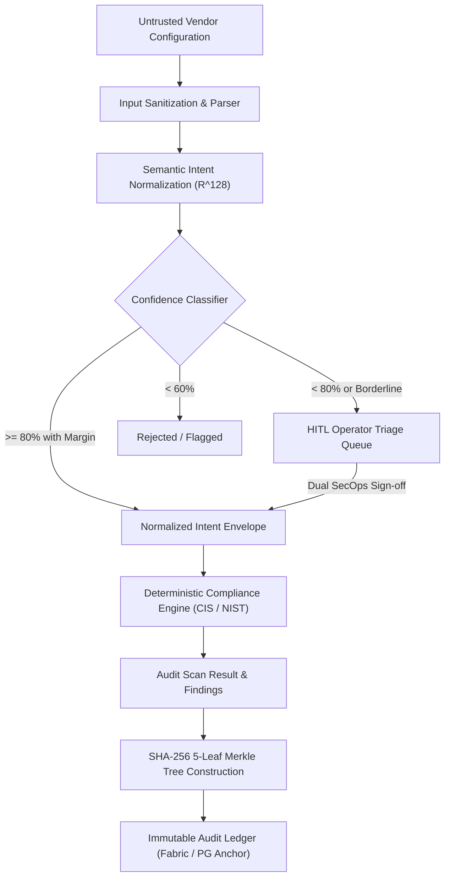

# NeuraComply: Threat Model & Security Architecture
**SIH Problem Statement:** PS 26155 — AI-Driven Multi-Vendor Network Security Compliance Auditor  
**System:** NeuraComply Auditor, Semantic Intent Pipeline, Triage Engine & Audit Ledger  
**Standard Reference:** STRIDE & NIST SP 800-53 Rev 5 Risk Management Framework

---

## Executive Principle: The Deterministic Safety Boundary

> **FOUNDATIONAL SECURITY INVARIANT:**  
> The AI Semantic Engine is strictly an **intent normalization and triage assistance pipeline**. It is **NEVER** the final compliance authority.  
> Final compliance determination (`passed`, `warning`, `violation`) is evaluated exclusively by the **deterministic policy engine** against authoritative, hardened CIS Benchmarks and NIST SP 800-53 controls.  
> An AI classification error cannot unilaterally declare an insecure network configuration compliant.

---

## 1. Threat Identification & Mitigation Matrix

### Threat 1: Malicious / Malformed Network Configuration Files
- **Threat Vector:** An attacker with local access uploads an excessively large configuration file (>100MB), a zip bomb, or specially crafted binary data attempting to cause Denial of Service (DoS) or memory exhaustion.
- **Impact:** System unresponsiveness, denial of audit service.
- **Mitigations:**
  - Strict file payload limit enforced at Express server layer (`express.json({ limit: '15mb' })`).
  - Text-only ASCII/UTF-8 sanitation before parsing.
  - Linear parsing bounds (`split('\n')`) with execution timeouts.

### Threat 2: Adversarial Configuration Syntax (Evasion Attacks)
- **Threat Vector:** A rogue administrator attempts to bypass compliance by disguising insecure commands with unusual whitespace, mixed cases, unicode lookalikes, or deceptive comments (e.g. `! ip ssh version 2\n transport input telnet`).
- **Impact:** Insecure services remain active while the auditor reports a false pass.
- **Mitigations:**
  - Lexical tokenization strips XML tags, comments, and delimiters before vector projection.
  - Negation and polarity axes explicitly verify whether a command is affirmative or negated.
  - The deterministic compliance engine conducts deep structural verification (e.g. actively inspecting whether `transport input all` exists anywhere on active VTY lines).

### Threat 3: Poisoned Knowledge Base Intent Mappings
- **Threat Vector:** An insider or compromised operator account attempts to register a malicious mapping in the Knowledge Base (e.g., claiming `transport input telnet` maps to `SSH_PROTOCOL_VERSION`).
- **Impact:** Future scans automatically misclassify cleartext Telnet as secure SSHv2.
- **Mitigations:**
  - **Schema Validation Gate:** Injected mappings must strictly conform to the predefined `Unified Security Schema` (USS). Arbitrary fields are discarded.
  - **Conflict Detection:** The knowledge base rejects mappings that directly contradict immutable core prototypes (e.g. mapping `telnet` to `SSH`).
  - **Operator Audit Trail:** Every knowledge base entry records the operator identity (`operatorSignedBy`), timestamp, and prior confidence score.

### Threat 4: Incorrect AI Classification (Model Hallucination / Drift)
- **Threat Vector:** An unusual or borderline configuration statement is misclassified by vector cosine similarity.
- **Impact:** Triage misrouting or inaccurate category classification.
- **Mitigations:**
  - **Margin Separation Requirement:** Confidence calculation requires a minimum $+10\%$ margin separation between top-1 and runner-up intents. If two conflicting intents are close in similarity, the statement is forced into `HUMAN_REVIEW`.
  - **Deterministic Policy Safeguard:** The policy engine checks the raw snippet before executing remediation commands.

### Threat 5: Unauthorized Human-in-the-Loop (HITL) Approval
- **Threat Vector:** An unauthenticated user accesses `/api/triage/:id/confirm` to unilaterally approve compliance exceptions or suppress violations.
- **Impact:** Unauthorized waiver of critical security controls.
- **Mitigations:**
  - Operator confirmation requires authenticated user identity (bound to Google SSO / SecOps Console role).
  - Every approval produces a cryptographically anchored ledger event (`REMEDIATION_CONFIRMED`) with previous-hash linkage, preventing retrospective deletion.

### Threat 6: Credential & Secret Exposure in Ingested Configs
- **Threat Vector:** Ingested configurations contain plain or hashed administrative passwords (`enable secret 9`, pre-shared keys, SNMP community strings).
- **Impact:** Exposure of corporate secrets in audit logs or reports.
- **Mitigations:**
  - Password hashes are sanitized in displayed snippets when rendered in public views.
  - Audit scans persist only the **SHA-256 content hash** to the immutable ledger, never cleartext secrets.
  - Raw snippets stored in PostgreSQL are access-controlled and restricted to authenticated auditor sessions.

### Threat 7: Audit Log & Finding Tampering (Rogue Administrator)
- **Threat Vector:** A rogue database administrator accesses PostgreSQL and alters historical scan results to conceal a breach or violation before a regulatory inspection.
- **Impact:** Loss of audit trail integrity, regulatory non-compliance.
- **Mitigations:**
  - **5-Leaf Merkle Tree:** Every audit scan builds a deterministic 32-byte Merkle root anchoring device metadata, configuration hash, control statuses, and violations.
  - **Cryptographic Hash Chaining:** Every ledger block includes `currentBlockHash = SHA256(blockNum || prevHash || payloadHash)`.
  - **Parent Hash Verification:** Any alteration of historical rows invalidates the chain (`/api/ledger/verify` instantly flags the exact broken block).
  - **External Anchor:** Merkle roots are anchored to Hyperledger Fabric channel consensus across independent organizations (`Org1MSP`, `AuditorMSP`).

### Threat 8: Remediation Script Execution Errors
- **Threat Vector:** An automatically generated or operator-approved remediation script causes network outages or device lockouts (e.g. disabling Telnet before SSH keys are generated).
- **Impact:** Management plane lockout, network disruption.
- **Mitigations:**
  - **Mandatory Rollback Scripts:** Every remediation finding must provide an accompanying, tested rollback command block.
  - **Dry-Run What-If Simulation:** Operators preview the exact posture impact and script syntax before staging execution.
  - **Staged Execution:** NeuraComply stages scripts for human sign-off; it does not blindly push CLI commands to live production devices without explicit operator confirmation.
